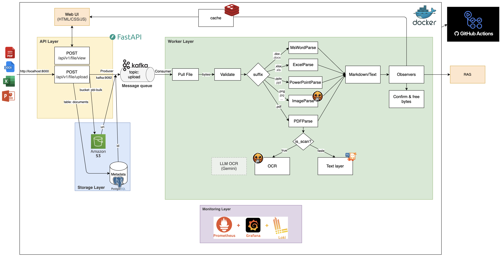

# Auto Document Parse
---
Contents:
- [Giới thiệu](#giới-thiệu)
- [Pipeline tổng quan](#pipeline-tổng-quan)
- [Cấu trúc thư mục](#cấu-trúc-thư-mục)
- [Hướng dẫn cài đặt](#hướng-dẫn-cài-đặt)
- [API](#API)
- [Các màn hình](#các-màn-hình)
---

## Giới thiệu
Hệ thống Auto Document Parse (ADP) là một giải pháp tự động hóa quy trình trích xuất và xử lý tài liệu. Hệ thống này bao gồm nhiều dịch vụ khác nhau để nhận, xử lý, trích xuất và lưu trữ tài liệu từ các nguồn khác nhau. Mục tiêu của ADP là giảm thiểu sự can thiệp thủ công trong việc xử lý tài liệu, tăng hiệu suất và độ chính xác trong việc trích xuất thông tin quan trọng. Cung cấp dữ liệu cho các dịch vụ khác như RAG hay tìm kiếm văn bản.

## Pipeline tổng quan
Hệ thống Auto Document Parse (ADP) được thiết kế để tự động trích xuất và xử lý tài liệu từ các nguồn khác nhau. Dưới đây là mô tả tổng quan về pipeline của hệ thống:
1. **Nhận tài liệu**: Hệ thống nhận tài liệu từ API hoặc tải lên qua giao diện web.
2. **Xử lý hàng đợi tin nhắn**: Tài liệu được đưa vào hàng đợi tin nhắn để quản lý và xử lý tuần tự, điều này giúp cân bằng tải cho server xử lý.
3. **Trích xuất tài liệu**: Dịch vụ trích xuất tài liệu sử dụng các mô hình học máy và kỹ thuật xử lý ngôn ngữ tự nhiên để phân tích và trích xuất thông tin quan trọng từ tài liệu.
4. **Lưu trữ dữ liệu**: Thông tin trích xuất được lưu trữ trong cơ sở dữ liệu hoặc hệ thống lưu trữ đám mây để dễ dàng truy cập và quản lý.
5. **Quan sát và giám sát**: Hệ thống có các dịch vụ quan sát để theo dõi hiệu suất và trạng thái của quá trình xử lý tài liệu, đảm bảo rằng mọi thứ hoạt động trơn tru và hiệu quả.
6. **Xử lý chính**: Một worker xử lý chính sẽ điều phối các bước trên, đảm bảo rằng tài liệu được xử lý đúng cách và kịp thời.
7. **Giao diện người dùng**: Người dùng có thể tương tác với hệ thống thông qua giao diện web để tải lên tài liệu, xem kết quả trích xuất và quản lý tài liệu đã xử lý.
8. **API**: Hệ thống cung cấp các endpoint API để tương tác với dịch vụ, cho phép tích hợp với các hệ thống khác hoặc tự động hóa quy trình làm việc.



## Cấu trúc thư mục
```bash
.
├── adp
│   ├── api
│   │   └── routers
│   ├── configs
│   │   ├── logger.py           # cấu hình logging
│   │   ├── models              # các mô hình cấu hình
│   │   │   └── observer.py
│   │   └── settings.py         # cấu hình ứng dụng loại singleton
│   ├── main.py
│   ├── services
│   │   ├── message_queue       # dịch vụ hàng đợi tin nhắn
│   │   ├── observer            # dịch vụ trả về
│   │   ├── parse               # dịch vụ trích xuất tài liệu
│   │   └── storage             # dịch vụ lưu trữ
│   └── workers
│       └── processor.py        # xử lý chính
├── docker-compose.yml
├── Dockerfile
├── docs                        # tài liệu dự án  
├── pyproject.toml
├── README.md
├── requirements.txt
└── tests                       # thư mục kiểm thử
```

## Hướng dẫn cài đặt
1. Download model (cài thư viện `kagglehub`):
```bash
python -m adp.services.parse.download_model
```	
hoặc truy cập [models-docling](https://www.kaggle.com/datasets/quachnam/models-docling) để tải model về và giải nén thư mục `weights/`.

Cấu trúc thư mục sau khi giải nén:
```lua
.
├── weights/
│	├── models_docling
│	└── tessdata
├── adp
...
```

2. Build image
```bash
docker build -t adp:latest .
```

3. Chạy bằng docker compose:
```bash
docker compose up -d
```


## API
Endpoints under the API require an API key via the `X-API-KEY` header.
Configure the expected key by creating a `.env` file at the project root with:

```env
SECRET_API_KEY=abc
```

Example request:

```bash
curl -s http://localhost:8000/api/v1/documents \
	-H "X-API-KEY: abc"
```

# Các màn hình

1. Giao diện Người dùng cuối (ADP UI)
URL: http://localhost:7860 (hoặc domain Tunnel của bạn).
Chức năng: Đây là màn hình web.
Tải lên hồ sơ (PDF/Ảnh).
Hiển thị kết quả trích xuất văn bản (Markdown/JSON).
Theo dõi trạng thái xử lý hồ sơ.

2. Giao diện Quản lý Kafka (Kafka UI)
URL: http://localhost:8088
Chức năng: Giám sát luồng dữ liệu giữa API và Worker.
Kiểm tra Topic upload xem có bao nhiêu bản tin đang chờ.
Theo dõi 2 replicas của worker_parse (Consumer Group) xem chúng có đang bị nghẽn (Lag) hay không.
Xem nội dung bản tin (S3 URI, metadata) đang chạy qua hệ thống.

3. Giao diện Tài liệu API (Swagger UI)
URL: http://localhost:8000/docs (Đã chặn khi dùng domain, chỉ xem được tại localhost).
Chức năng: Dành cho lập trình viên.
Thử nghiệm các Endpoint như /api/v1/file/view.
Kiểm tra định dạng JSON đầu ra của hệ thống Parse.

4. Giao diện Giám sát Tổng thể (Grafana Dashboard)
URL: http://localhost:3000
Chức năng: Trung tâm điều hành (SOC).
Theo dõi phần cứng: Xem mức độ tiêu thụ CPU/RAM của các worker (thông qua Node Exporter).
Xem Log tập trung: Truy vấn log từ API và Worker (thông qua Loki & Promtail) để biết tại sao một hồ sơ bị lỗi mà không cần SSH vào container.
Thống kê: Biểu đồ số lượng hồ sơ đã parse thành công theo thời gian.

5. Giao diện Lưu trữ số liệu (Prometheus UI)
URL: http://localhost:9090
Chức năng: Công cụ kỹ thuật của SRE.
Kiểm tra trạng thái "sống/chết" (Healthcheck) của các dịch vụ (Redis, Postgres, Kafka).


